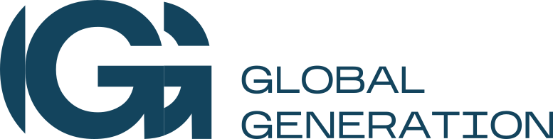

<!-- gg-readme-header:start -->
<div align="center">
  <picture>
    <source media="(prefers-color-scheme: dark)" srcset=".github/assets/global-generation-white.svg">
    
  </picture>

  <h1>Infra Brand Identity</h1>

  <p>Айдентика внутренних сервисов Global Generation: логотип, цвета, шрифт, фавиконы и правила.</p>

  <p>
    
    
    
  </p>

  <p>
    <a href="#правила-утверждены-лёвом-28092026">Правила (утверждены Лёвом 28.09.2026)</a> ·
    <a href="#контуры-и-цвета-плиток">Контуры и цвета плиток</a> ·
    <a href="#пересобрать">Пересобрать</a> ·
    <a href="#где-уже-применено">Где уже применено</a>
  </p>
</div>
<!-- gg-readme-header:end -->

---

- `index.html` - страница айдентики (формат как у aura-ecosystem.com/brand.html, палитра GG): логотип, цвета, шрифт, компоненты, голос, сетка, токены, правила. Открыть в браузере.
- `lockups.html` - 10 вариантов подписи «логотип | сервис». Утверждён **вариант 2 «Во всю высоту»** (28.09.2026).
- `favicons-variants.html` - 10 вариантов фавиконов вместо «градиент + lucide» и значок на экране входа вместо замка (07.10.2026, на выборе у Лёва). Сборка: `uv run --with fonttools --with brotli python src/build_favicon_variants.py`, выбранный вариант в `assets/favicons/`: `... --apply N`.
- `assets/` - готовые файлы: бери отсюда, не рисуй заново.

## Правила (утверждены Лёвом 28.09.2026)

1. **Логотип один**: `assets/logo/global-logo-navy.svg` (знак + GLOBAL GENERATION широким гротеском) **одним цветом**: navy `#13445d` на светлом, белый (`global-logo-white.svg`) на тёмном. Везде: экран входа, шапки сервисов, письма, счета, PDF. Своих вордмарков, локапов на Montserrat и двухцветного знака нет.
2. **Название сервиса** рядом с логотипом через тонкую вертикальную линию **во всю высоту логотипа** (1 px, navy 20% на светлом, белый 35% на тёмном), отступ 14 px, Montserrat 600 navy (на тёмном белым).
3. **Фавиконы** - плитки с **градиентом** (не заливкой) по контуру, белая иконка lucide: `assets/favicons/<сервис>.svg`, список в `manifest.json`. Корень GG (вход, каталог, письма) - `root.svg`.
4. **Джи-джи не трогаем**: только маскот `assets/gigi/gigi-mascot.png` как есть (это и аватарка @GGenbot_bot). Без плиток, градиентов, перекраски и замены иконкой.
5. Цвета: navy `#13445d` (главное действие, активная вкладка), один акцент голубой `#009CDC`, ссылки текстом `#0077a8`, фон страницы `#e7eff8 → #eef3f9`, карточки белые. Токены: `assets/tokens/gg-tokens.css`.
6. Шрифт Montserrat самохостом (`src/fonts.css`), никаких CDN шрифтов. Иконки только lucide инлайн SVG.
7. Нельзя: эмодзи, длинное тире, фиолетовый/сиреневый, декоративные полосы слева или сверху, «больничные» пастели.
8. Копирайт: «ментор» (не «наставник»), «Джи-джи» (не «ИИ»); стаффу чётко и корпоративно, студенту тепло, как Duolingo.

## Контуры и цвета плиток

| Контур | Сервисы | Градиент |
|---|---|---|
| Менторский | АКБ, Пульс, Кабинет ментора | `#2a7aa3 → #0d2f42` |
| Студенческий | Студенческий портал (Маяк: свой маскот) | `#6fd0f5 → #0086c2` |
| Операционный | Юротдел, Бухгалтерия, Репортер, Онбординг | `#35a6d6 → #085a80` |
| Ядро | levauth, Стратегия, LLM-расходы | `#4b5b73 → #0f172a` |

## Пересобрать

```
python3 src/build.py          # index.html из src/template.html
python3 src/build_lockups.py  # lockups.html
python3 src/check.py          # Playwright: 1440/390 px, шрифты, тире, ошибки (нужен playwright)
```

Правки дизайна - в `src/template.html`, потом сборка и `check.py`. Новый сервис: строка в `SERVICES` внутри `template.html` (+ иконка в `src/lucide-icons/`), пересобрать, сгенерить фавикон так же, как остальные.

## Где уже применено

- АКБ (GG-Product-Mentorship-AKB): на дев-стенде https://hub-dev.global-generations-edu.com ветка `exp/brand-v2` (шапка с логотипом, фавикон, вход, фон). Прод АКБ пока с текстовым заголовком «АКБ Global Generation».
