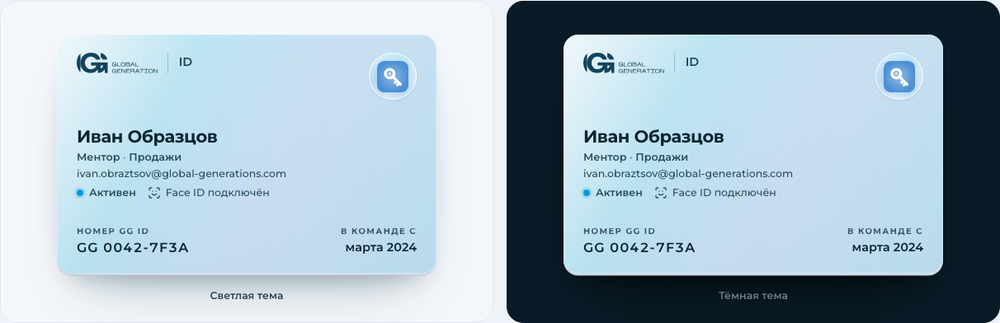
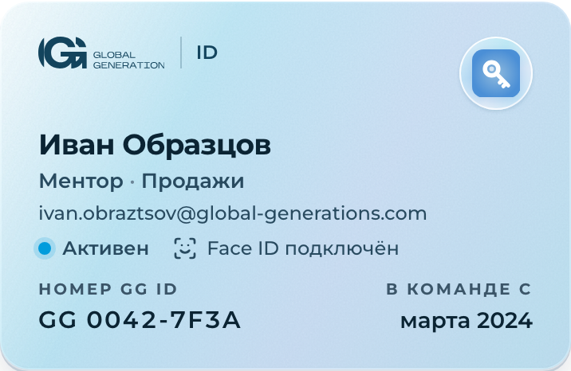
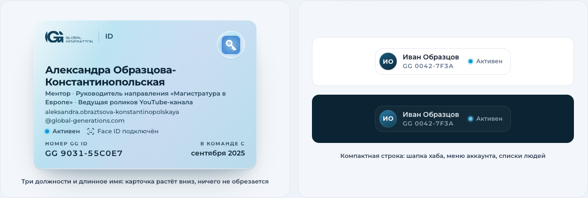
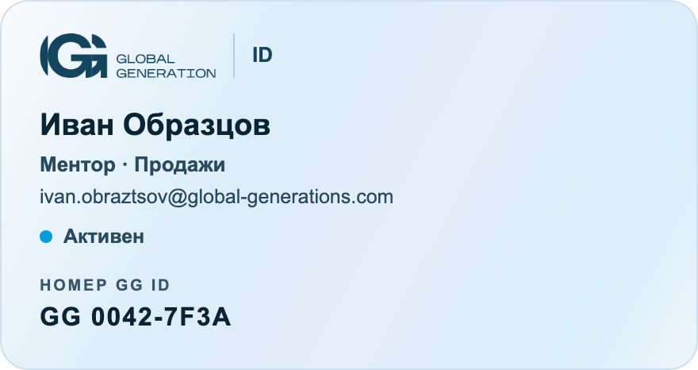
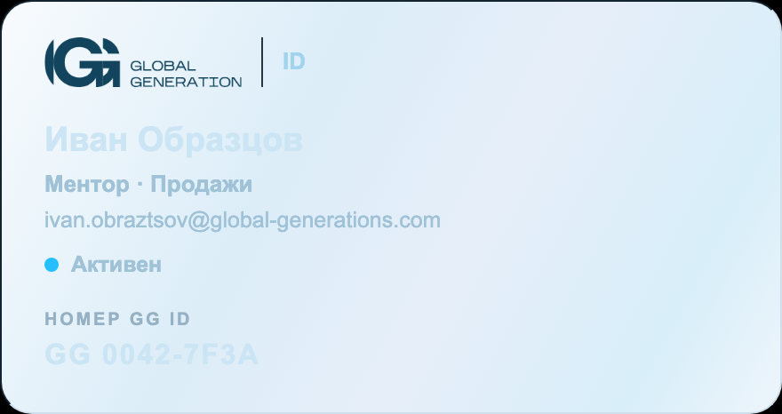

# GG ID: единый вход Global Generation

Кит экранов входа для хаба GG ID (`id.global-generations-edu.com`, старый адрес levauth пока алиас; IdP = Lambda `gg-portal-auth`) и компонентов для сервисов. Один вход, один вид во всех сервисах GG.

- Витрина: `../gg-id.html` (все экраны, 3 раскладки, светлая и тёмная тема, телефон и компьютер, компоненты, правила). Ссылка на состояние: `gg-id.html#s=error&l=card&t=dark&d=phone`.
- Эталонные страницы: `screens/<экран>.html`, открываются как есть. Раскладка и тема параметрами: `screens/login.html?layout=card&theme=dark`. Переходы между ними демо: в хабе их заменяют вызовы `/api/auth/*`.

## Файлы

| Файл | Что внутри |
|---|---|
| `gg-id.css` | токены (светлая и тёмная тема), раскладки `split`, `card`, `minimal`, все компоненты |
| `gg-id.js` | без зависимостей и без сети: глаз пароля, только рабочая почта, правила нового пароля, ячейки кода, обратный отсчёт, подписи Face ID / Touch ID / Windows Hello |
| `fonts/` | Montserrat v31 (переменный, 400-700) самохостом: кириллица, латиница и `latin-ext` (латиница с диакритикой и знаки валют, в том числе ₽; sha256 `920711de…0082`, грузится, только если на странице есть такие знаки) |
| `gg-id-service.js` | поведение компонентов в сервисах: меню аккаунта, окно «Сессия истекла», перехват 401 своего origin (раздел «Поведение в сервисе») |
| `sprite.svg` | логотип `gid-logo`, иконка GG ID `gid-id-icon` (`gid-tile` = её старое имя) и все иконки `gi-*` одним файлом: `<use href="/assets/gg-id/sprite.svg#gi-eye"/>` (тот же origin) |
| `gg-id-icon.svg` | иконка GG ID отдельным файлом (копия `assets/favicons/gg-id.svg`) |
| `screens/` | 18 эталонных страниц (17 экранов входа и карточка GG ID), генерируются, руками не править |
| `email-card.html` | карточка GG ID и кнопки письма-приглашения (стиль «Итог», как письмо Infra-AWS #93): таблицы, встроенные стили, подстановки `{{...}}` |
| `email/gg-logo-navy-2x.png` | navy-логотип для писем на светлом фоне (302 x 76), генерируется `src/rasterize_gg_id_email.py` |
| `email/gg-id-lockup-2x.png` | прежняя подпись «логотип \| ID» для navy-карты (белая на navy-плашке), остаётся для писем, которые её берут |
| `preview/` | картинки карточки для этого README и PR, обновляет `src/check_gg_id.py --preview` |
| `VERSION` | версия кита (дата релиза, например `2026-10-08.2`); её же отдают `GGID.version` и `GGIDService.version`, сборка сверяет. Поднимать при каждой правке кита |

Хаб копирует `gg-id.css`, `gg-id.js`, `fonts/`, `sprite.svg`, `gg-id-icon.svg` и `email/` к себе, сервисы берут `gg-id.css` (или нужные блоки), `gg-id-service.js` и `fonts/` (например в `/assets/gg-id/`). Пути к шрифтам в CSS относительные: `fonts/...` рядом с `gg-id.css`. Картинки из `email/` письма берут по https: `https://id.global-generations-edu.com/assets/gg-id/email/gg-logo-navy-2x.png`.

## Каркас страницы

```html
<body class="gid-body">
<div class="gid" data-layout="split">            <!-- split (рекомендую) | card | minimal; data-theme="dark" только чтобы зафиксировать тему, иначе по системе -->
  <div class="gid-frame">
    <aside class="gid-aside">...</aside>          <!-- только для split: подпись, карта GG ID на ленте, текст; разметку брать из screens/login.html -->
    <main class="gid-main">
      <section class="gid-card">
        <div class="gid-lockup"><svg class="gid-logo" viewBox="0 0 777 196" role="img" aria-label="Global Generation"><use href="#gid-logo"/></svg><span class="gid-lockup-name">ID</span></div>
        <h1 class="gid-h">Вход в АКБ</h1>         <!-- название сервиса из client_id -->
        <p class="gid-sub">...</p>
        ...
      </section>
      <footer class="gid-foot"><span><b>GG ID</b> · единый вход Global Generation</span></footer>
    </main>
  </div>
</div>
<!-- спрайт иконок и логотипа: скопировать из любого screens/*.html -->
<script src="/assets/gg-id/gg-id.js"></script>
</body>
```

Раскладки переключаются только атрибутом, разметка одна. Ширину кит меряет container queries, поэтому тот же экран правильно ложится и во всё окно, и в модальное окно сервиса.

## Разметка поведения

| Атрибут | Что делает |
|---|---|
| `data-gid-passkey="login\|enroll\|wait"` | текст кнопки по устройству: «Войти с Face ID», «Войти с Touch ID», «Войти с Windows Hello», «Войти по отпечатку», «Войти по ключу доступа» |
| `data-gid-passkey-icon` на `<svg>` | значок к ней: лицо, отпечаток или ключ |
| `data-gid-eye` | кнопка «показать пароль» в `.gid-input-wrap` |
| `data-gid-domain="global-generations.com"` + `[data-gid-domain-hint]` | подсказка «только рабочая почта» сразу после ввода, до сервера |
| `data-gid-newpass`, `data-gid-repeat`, `[data-gid-meter]`, `[data-gid-rules] [data-rule=len\|mix\|case]` | шкала и галочки нового пароля вживую (правила как на сервере: 12-256 символов, буквы и цифры, заглавные и строчные) |
| `data-gid-code` | ячейки кода: ввод, вставка целиком, стирание назад; готовый код = событие `gid:code` с `detail.code` |
| `data-gid-countdown="42"` + `data-gid-countdown-done="enable:#id\|reload"` | обратный отсчёт «через 0:42», по нулю включает кнопку или перезагружает страницу |
| `[data-gid-error]` + `[data-gid-error-text]` | блок ошибки над кнопкой |

JS: `GGID.busy(btn, true, 'Входим')` и `GGID.busy(btn, false)` (кнопка занята, второй запрос не уходит), `GGID.error(root, 'Неверная почта или пароль', [email, password])` (текст, подсветка, встряска), `GGID.shake(el)`, `GGID.passkeyKind()`, `GGID.passwordChecks(v)`, `GGID.version` (версия кита, = `gg-id/VERSION`). Если разметка появляется позже, вызвать `GGID.init(root)`.

## Как связать со входом хаба

Логика как в текущем `login.html` хаба, меняется только вид:

1. `GET /api/auth/capabilities`: `password_reset` показывает «Забыли пароль?». Входа через Aura на экранах GG ID нет (`aura_login` экраны не читают).
2. `GGPasskey.platformAvailable()` и `GGPasskey.enabled()`: если ключ есть, первый экран `login` (Face ID главной кнопкой); если нет, сразу `password`.
3. Face ID: `GGID.busy(btn, true)` и состояние `passkey`, затем `GGPasskey.login()`. `NotAllowedError` (человек отменил) = тихо назад, без ошибки. Другая ошибка = «Face ID не сработал, войдите по паролю» и экран `password`.
4. Пароль: `POST /api/auth/login`. 401 = «Неверная почта или пароль. Проверьте раскладку и Caps Lock.», 429 = «Слишком много попыток, подождите минуту», сеть = «Сеть недоступна». Поле пароля очистить, фокус в него.
5. Успех: экран `done` (сборка знака) и `location.replace(next)`. После входа по паролю на устройстве без ключа сначала `enroll` (`GGPasskey.register()`), «Не сейчас» идёт дальше.
6. `next` проверять как сейчас: только тот же origin, не `/login.html`.

<!-- screens:start -->
## Экраны

| Экран | Файл | Когда | Хаб |
|---|---|---|---|
| Вход | `screens/login.html` | Первый экран. Главная кнопка Face ID, если на устройстве есть ключ входа; если нет, сразу экран пароля. | `GET /api/auth/capabilities, GGPasskey.enabled(), GGPasskey.login()` |
| По паролю | `screens/password.html` | Почта и пароль. После входа без ключа на устройстве предлагаем подключить Face ID. | `POST /api/auth/login` |
| Ошибка | `screens/error.html` | 401: неверная почта или пароль, поля трясутся, пароль очищается. 429: «Слишком много попыток, подождите минуту». Сеть: «Сеть недоступна». | `POST /api/auth/login: 401, 429` |
| Face ID | `screens/passkey.html` | Открыто системное окно Face ID. Кнопка занята, второй запрос не уходит. Отмена в системном окне возвращает на первый экран без ошибки. | `GGPasskey.login()` |
| Готово | `screens/done.html` | Вход выполнен, идёт переход в сервис. Фирменная сборка знака, как прелоудер бренда. | `GET /api/auth/me, переход на next` |
| Продолжить как | `screens/continue.html` | Сессия GG ID на устройстве уже есть, сервис просит подтвердить аккаунт. | `GET /api/auth/authorize` |
| Подключить Face ID | `screens/enroll.html` | После входа по паролю, если ключа на этом устройстве нет. Совет: после «Не сейчас» не спрашивать на этом устройстве неделю. | `GGPasskey.register()` |
| Забыли пароль | `screens/forgot.html` | Восстановление по рабочей почте. | `POST /api/auth/forgot` |
| Письмо отправлено | `screens/sent.html` | Ответ одинаковый, есть такая почта в GG ID или нет: так нельзя проверить, кто в команде. | `POST /api/auth/forgot: 200` |
| Новый пароль | `screens/setpass.html` | Ссылка из приглашения или восстановления (#token=). Приглашение: «Добро пожаловать в команду», восстановление: «Новый пароль». Правила как на сервере. | `POST /api/auth/set-password/check, POST /api/auth/set-password` |
| Пароль сохранён | `screens/saved.html` | После сохранения пароля. Сессии нет, человек идёт ко входу, браузер сам подставит новый пароль. | `POST /api/auth/set-password: 200` |
| Восстановление выключено | `screens/resetoff.html` | capabilities.password_reset не true: восстановление по почте выключено, вместо формы эта плашка. | `GET /api/auth/capabilities` |
| Ссылка устарела | `screens/expired.html` | Токен из ссылки устарел или уже использован. | `POST /api/auth/set-password/check: ошибка` |
| Нет доступа | `screens/noaccess.html` | Человек вошёл, но роли в этом сервисе у него нет. | `GET /api/auth/me (level), entitlements` |
| Код доступа | `screens/pin.html` | Переходный вход по коду для сервисов, которые ещё не на GG ID. | `sso-gate: PIN-ворота` |
| Недоступен | `screens/unavailable.html` | GG ID не отвечает (5xx или таймаут). Страница сама пробует снова. | `sso-gate: sso-unavailable` |
| Вы вышли | `screens/signedout.html` | После «Выйти» в меню аккаунта. | `POST /api/v1/sessions/revoke` |
| Карточка GG ID | `screens/card.html` | Карточка сотрудника, как студенческий ID: вверху кабинета «Мои сервисы», на первом входе после приглашения (онбординг) и образцом в инструкции «Как войти». В письме-приглашении её копия gg-id/email-card.html. | `GET /api/auth/me: display_name, email (уже есть); positions, gg_id, since, status (добавить); GGPasskey.list()` |
<!-- screens:end -->

## Компоненты для сервисов

Сервис не рисует свою форму пароля и PIN. Обёртка `class="gid-kit"` даёт токены (тема по системе или `data-theme`).

### Иконка GG ID

Иконка GG ID = белый ключ на светлом градиенте `#8FBADD → #4B8FD6` (токен `--grad-tile`), файл `assets/favicons/gg-id.svg` (тот же ключ, что `levauth.svg` хаба). Она стоит в кнопке «Войти через GG ID», в окне «Сессия истекла» и в фавиконе всех экранов GG ID, витрины и презентаций GG ID (`assets/favicons/gg-id.svg`, `png/gg-id-*.png`, `ico/gg-id.ico`). Тёмную плитку корня GG (`root.svg`) в кнопках и окнах не ставим: правило 4a, тёмные градиентные плитки в интерфейсе запрещены. Символ спрайта `gid-id-icon`; старое имя `gid-tile` теперь показывает ту же иконку, старая разметка менять картинку не обязана.

<!-- idicon:start -->
```html
<!-- кнопка в сервисе (свой origin): иконка инлайном, спрайт хаба не нужен -->
<a class="gid-sso" href="https://id.global-generations-edu.com/api/auth/authorize?..."><svg class="gid-sso-tile" viewBox="0 0 64 64" aria-hidden="true" focusable="false"><defs><radialGradient id="gid-id-icon-inline-g" cx="32" cy="32" r="32" gradientUnits="userSpaceOnUse"><stop stop-color="#8FBADD"/><stop offset="1" stop-color="#4B8FD6"/></radialGradient></defs><rect width="64" height="64" rx="14.8" fill="url(#gid-id-icon-inline-g)"/><g transform="translate(10.00 10.00) scale(0.6875)"><path d="M6 23A17 17 0 1 0 40 23A17 17 0 1 0 6 23ZM14.5 23A8.5 8.5 0 1 0 31.5 23A8.5 8.5 0 1 0 14.5 23Z" fill="#ffffff" fill-rule="evenodd"/><path d="M33 33L55 55M44 44L38.5 49.5M51 51L45.5 56.5" fill="none" stroke="#ffffff" stroke-width="7.5" stroke-linecap="round"/><circle cx="23" cy="23" r="4.5" fill="rgba(255,255,255,0.7)"/></g></svg><span>Войти через GG&nbsp;ID</span></a>

<!-- на хабе (тот же origin): символ спрайта -->
<svg class="gid-sso-tile" viewBox="0 0 64 64" aria-hidden="true"><use href="/assets/gg-id/sprite.svg#gid-id-icon"/></svg>
```
<!-- idicon:end -->

### Кнопки: стиль A (08.10)

Без navy-заливки. Главная кнопка экранов входа (`.gid-btn--primary`) и «Войти через GG ID» (`.gid-sso`): белые с тонкой рамкой `#c9d5e1`, иконка в светлой плитке (`--grad-tile`) слева, navy-текст, у главной кнопки стрелка справа. Вторая кнопка (`.gid-btn--secondary`) текстом, без рамки, подчёркивание под курсором. На тёмном фоне (тёмная тема кита или `gid-sso--on-dark`): полупрозрачный белый 4 % с рамкой 22 %, текст белый. Высота от 44 px (`--sm` тоже), контраст подписи от 4,5 проверяет `check_gg_id.py`. Иконку для плитки главной кнопки кладите первым `<svg class="gid-ic">` внутри кнопки, плитку и стрелку кит рисует сам.

### Разметка

```html
<!-- единственная кнопка входа на экране сервиса: ведёт на /api/auth/authorize хаба (параметры по SSO-контракту хаба, как у sso-gate) -->
<a class="gid-sso" href="https://id.global-generations-edu.com/api/auth/authorize?...">
  <svg class="gid-sso-tile" viewBox="0 0 64 64" aria-hidden="true"><use href="#gid-id-icon"/></svg><span>Войти через GG&nbsp;ID</span>
</a>
<!-- варианты: gid-sso--light (на белом), gid-sso--on-dark (на navy), gid-sso--sm (в шапке), gid-sso--block (во всю ширину) -->

<!-- «Резервный вход»: прежний вход сервиса, пока он нужен, свёрнут под кнопкой; раскрывается мышью и с клавиатуры (Enter, пробел) -->
<details class="gid-fb">
  <summary class="gid-link gid-link--muted gid-link--sm"><span>Резервный вход</span><svg class="gid-ic" aria-hidden="true"><use href="#gi-chevron-down"/></svg></summary>
  <form class="gid-form" method="post" action="...">…прежняя форма…</form>
</details>

<!-- аккаунт в шапке: чип и выпадающее меню в одной обёртке .gid-acct -->
<div class="gid-acct gid-kit" data-theme="light">
  <button class="gid-chip" type="button" aria-expanded="false" aria-haspopup="menu" aria-controls="gid-acct-menu">
    <span class="gid-avatar gid-avatar--xs" aria-hidden="true">ИО</span><span class="gid-chip-name">Иван</span>
    <svg class="gid-ic" aria-hidden="true"><use href="#gi-chevron-down"/></svg>
  </button>
  <div class="gid-menu" id="gid-acct-menu" role="menu" aria-label="Аккаунт" hidden>
    <div class="gid-menu-head"><span class="gid-avatar" aria-hidden="true">ИО</span>
      <div class="gid-menu-head-tx"><b>Иван Образцов</b><span>ivan.<wbr>obraztsov<wbr><span class="gid-nowrap">@global-generations.com</span></span></div></div>
    <a class="gid-menu-item" role="menuitem" href="https://id.global-generations-edu.com/cabinet/"><svg class="gid-ic" aria-hidden="true"><use href="#gi-layout-grid"/></svg>Мои сервисы</a>
    <div class="gid-menu-sep"></div>
    <button class="gid-menu-item" role="menuitem" type="button"><svg class="gid-ic" aria-hidden="true"><use href="#gi-log-out"/></svg>Выйти</button>
  </div>
</div>

<!-- сессия истекла (сервис получил 401): окно поверх страницы, не выброс на логин -->
<div class="gid-scrim gid-kit" data-theme="light" id="gid-expired" hidden>
  <div class="gid-dialog" aria-labelledby="gid-expired-h">
    <h2 class="gid-h" id="gid-expired-h">Сессия истекла</h2>
    <p class="gid-sub">Войдите снова, и мы вернём вас на эту же страницу.</p>
    <a class="gid-sso gid-sso--block" href="/auth/gg-id/login" data-gid-return="next"><svg class="gid-sso-tile" viewBox="0 0 64 64" aria-hidden="true"><use href="#gid-id-icon"/></svg><span>Войти через GG&nbsp;ID</span></a>
  </div>
</div>
<script src="/static/gg-id/gg-id-service.js" defer></script>
```

- Чип ужимается вместе с шапкой: сначала уходит стрелка, потом имя (`.gid-chip-name`) обрезается многоточием, а когда на него остаётся меньше 2,4 em, в чипе остаются только инициалы (круг 40 px). В шапке логотип с подписью `flex: none`, обёртке аккаунта ничего ставить не надо: у `.gid-acct` и `.gid-chip` уже `min-width`, `max-width: 100%`.
- Меню выпадает под чипом у правого края (`.gid-acct > .gid-menu`); если шапка переносится и аккаунт стоит слева, `.gid-acct--start`.
- Аватар не зависит от контейнера: текст в шапке меню только через `.gid-menu-head-tx` (правило вида `.контейнер span` больше не перекрашивает инициалы). Длинные имя и почта в шапке меню переносятся.
- Почта везде (шапка меню, строка аккаунта, «Нет доступа», «Проверьте почту», карточка) переносится перед @ и после точек в длинном имени, домен целиком: `ivan.<wbr>obraztsov<wbr><span class="gid-nowrap">@global-generations.com</span>` (`GGID.card` расставляет переносы сам). Подсказки с доменом тоже: `<span class="gid-nowrap">@global-generations.com</span>`.
- «Резервный вход» (`details.gid-fb`): свёрнут по умолчанию, подпись `Резервный вход` и стрелка `gi-chevron-down` (поворачивается, когда раскрыт). Внутри прежняя форма сервиса или, как на хабе, переключатель режима формы выше. Слово «админ» на публичных страницах не пишем.
- Цвета кнопок и пунктов меню под курсором заданы явно: `a:hover` страницы сервиса их не перекрашивает.

Разметку целиком брать из витрины (раздел «Компоненты для сервисов»).

## Поведение в сервисе: `gg-id-service.js`

Один файл на все сервисы вместо своих копий. Без зависимостей и без сетевых вызовов. Подключение: `<script src="/static/gg-id/gg-id-service.js" defer></script>`. Сам находит разметку выше и оживляет её.

| Что | Как |
|---|---|
| Меню аккаунта | клик по чипу открывает и закрывает; Enter или пробел на чипе открывают с фокусом на первом пункте; ↓ и ↑ на закрытом чипе открывают; в меню ↓ ↑ Home End ходят по пунктам, Esc закрывает и возвращает фокус на чип, Tab закрывает и уводит фокус дальше, клик вне меню закрывает, выбор пункта закрывает. Открыто только одно меню |
| Safari и Firefox на Mac | кнопка не получает фокус по клику мышью: файл сам ставит фокус на чип, клавиши слушает на документе (Esc работает, даже если фокус на body) |
| Окно «Сессия истекла» | открывается на 401 от `fetch` на свой origin, вызовом `GGIDService.sessionExpired()` или событием `gid:session-expired` на `document`; фокус на кнопке входа, Tab и Shift+Tab не уходят под окно, Esc и клик по фону закрывают, фокус возвращается туда, где был |
| Перехват 401 | `fetch` оборачивается один раз, только ответы своего origin; пути из `data-gid-401-ignore` не открывают окно (например проверка `/api/me` на странице входа) |

Разметка и атрибуты:

| Где | Атрибут или класс | Зачем |
|---|---|---|
| обёртка аккаунта | `.gid-acct` | чип `.gid-chip` и меню `.gid-menu` внутри (или меню по `aria-controls` на чипе) |
| чип | `aria-expanded`, `aria-controls` | состояние меню; файл ставит их сам, если нет |
| пункты меню | `role="menuitem"` или `.gid-menu-item` | по ним ходят стрелки |
| окно | `id="gid-expired"` или `data-gid-expired` | окно «Сессия истекла», изначально `hidden` |
| окно | `data-gid-401-ignore="/api/me /health"` | пути (начало пути), чей 401 окно не открывает |
| кнопка входа в окне | `data-gid-return="next"` | при открытии окна к ссылке добавляется `?next=<эта страница>`; ставить, только если вход сервиса принимает такой параметр |

JS:

```js
GGIDService.init(root)            // оживить разметку внутри root (по умолчанию document); повторный вызов безопасен
GGIDService.openMenu(acct)        // открыть меню (acct = элемент .gid-acct; без аргумента все)
GGIDService.closeMenu(acct)       // закрыть меню
GGIDService.sessionExpired()      // открыть окно «Сессия истекла» (то же, что событие gid:session-expired)
GGIDService.closeSessionExpired() // закрыть окно
GGIDService.watchFetch({ignore: ['/api/me']})  // включить перехват 401 (автоматически, если на странице есть окно)
GGIDService.version               // '2026-10-08.2' = gg-id/VERSION (GGID.version в gg-id.js такая же)
```

События: `gid:menu-open` и `gid:menu-close` на `.gid-acct`, `gid:expired-open` и `gid:expired-close` на окне. `window.GGID_SERVICE_MANUAL = true` до подключения отключает автозапуск: тогда `GGIDService.init()` и `GGIDService.watchFetch()` вызываются вручную (так делают React-сервисы, у которых разметка появляется позже).

## Карточка GG ID

Карточка сотрудника, как студенческий ID в Duke или Stanford: имя, должности, рабочая почта и номер GG ID. Один взгляд, и человек видит, под каким аккаунтом вошёл.

Где показываем: вверху кабинета «Мои сервисы» (`/cabinet/` хаба), на первом входе после приглашения и в онбординге, образцом в инструкции «Как войти» (`kak-voyti.html`). В письме-приглашении её копия `email-card.html` (ниже). Эталон: `screens/card.html`; витрина: `gg-id.html#s=card` и раздел «Карточка GG ID».

- Вид «Итог» (08.10): белая пластиковая карта с голубым голографическим переливом, ключ GG ID в голографической печати (символ `gid-id-icon`), подпись «логотип | ID» navy. Без фото и без плашки инициалов.
- Карта светлая в обеих темах, как настоящая; тема меняет только тень (`--g-idc-shadow`). Перелив только в голубых и серебряных тонах.
- Размер: `width: 100%`, `max-width: var(--gid-idcard-w, 460px)`, высота не меньше ширины x 54 / 85,6 (пропорции настоящей карты 85,6 x 54 мм). На телефоне во всю ширину контейнера. Если данных больше (длинное имя, три длинные должности, длинная почта на узкой карте), карта растёт вниз, ничего не обрезается.
- Пропорцию держит распорка `.gid-idcard::before`, а не `aspect-ratio`: во flex- и grid-родителях `aspect-ratio` не даёт карте вырасти, и текст вылезает. В flex-ряду с `align-items: stretch` карточка тянется на высоту ряда: поставить ей `align-self: flex-start`.
- Один акцент: голубая точка статуса «Активен» (в строке под почтой, рядом «Face ID подключён»). Больше на карточке ничего не подсвечиваем.
- Та же карта висит героем на панели сплита (раздел «Экран входа: панель с картой»).
- Ставится внутри `.gid` или `.gid-kit` (оттуда шрифт и токены). Над заголовком экрана карточку не ставим: сначала заголовок, потом карточка.



| Телефон, 390 px | Длинные данные и компактная строка |
|---|---|
|  |  |

Картинки обновляет `uv run --with playwright python src/check_gg_id.py --preview` (после зелёной проверки).

### Разметка

Обычная карточка и компактная строка (генерируется из `src/build_gg_id.py`, та же строка, что в `screens/card.html` и витрине; данные вымышленные):

<!-- idcard:start -->
```html
<article class="gid-idcard" aria-label="Global Generation ID: Иван Образцов">
  <span class="gid-idcard-holo" aria-hidden="true"></span>
  <div class="gid-idcard-top">
    <div class="gid-lockup"><svg class="gid-logo" viewBox="0 0 777 196" role="img" aria-label="Global Generation"><use href="#gid-logo"/></svg><span class="gid-lockup-name">ID</span></div>
    <span class="gid-idcard-seal" aria-hidden="true"><svg class="gid-idcard-key" viewBox="0 0 64 64" focusable="false"><use href="#gid-id-icon"/></svg></span>
  </div>
  <div class="gid-idcard-who">
    <p class="gid-idcard-name" data-gid-field="name">Иван Образцов</p>
    <ul class="gid-idcard-roles" data-gid-field="positions" aria-label="Должности"><li>Ментор</li><li>Продажи</li></ul>
    <p class="gid-idcard-mail" data-gid-field="email">ivan.<wbr>obraztsov<wbr><span>@global-generations.com</span></p>
    <p class="gid-idcard-meta"><span class="gid-idcard-status" data-gid-field="status" data-status="active">Активен</span><span class="gid-idcard-passkey" data-gid-field="passkey"><svg class="gid-ic" aria-hidden="true"><use href="#gi-scan-face"/></svg>Face ID подключён</span></p>
  </div>
  <div class="gid-idcard-facts">
    <dl class="gid-idcard-fact"><dt>Номер GG ID</dt><dd class="gid-idcard-num" data-gid-field="id">GG 0042-7F3A</dd></dl>
    <dl class="gid-idcard-fact"><dt>В команде с</dt><dd data-gid-field="since">марта 2024</dd></dl>
  </div>
</article>

<!-- компактная строка -->
<div class="gid-idrow"><span class="gid-avatar gid-avatar--sm" data-gid-field="initials" aria-hidden="true">ИО</span><span class="gid-idrow-tx"><b data-gid-field="name">Иван Образцов</b><span class="gid-idrow-num" data-gid-field="id">GG 0042-7F3A</span></span><span class="gid-idcard-status" data-gid-field="status" data-status="active">Активен</span></div>
```
<!-- idcard:end -->

### Экран входа: панель с картой

В раскладке `split` вместо бегущих названий сервисов на navy-панели висит карта GG ID: лента с клипсой, прозрачный держатель, лёгкий 3D-наклон и покачивание (выключаются при «меньше движения»). На компьютере панель слева, карта подстраивается под высоту окна; на телефоне панель компактно сверху (подпись и карта, текст панели скрыт), форма под ней.

```html
<aside class="gid-aside">
  <div class="gid-lockup">…логотип | ID…</div>
  <div class="gid-aside-hero"><div class="gid-hero" aria-hidden="true"><div class="gid-hero-hang">
    <div class="gid-hero-lan"><span class="gid-hero-strap"></span><svg class="gid-hero-clip" viewBox="0 0 30 36">…</svg></div>
    <div class="gid-hero-holder"><span class="gid-hero-gloss"></span>
      <article class="gid-idcard gid-idcard--hero">…GG ID, имя, должность, номер, QR…</article>
    </div>
  </div></div></div>
  <div class="gid-aside-copy">…</div>
</aside>
```

- Разметку брать целиком из `screens/login.html`. До входа на карте данные-шаблон: «Имя Фамилия», «Должность», `GG 0042-7F3A`.
- Текст панели (правило 08.10): страницы входа публичные, поэтому списка внутренних сервисов на них нет. Заголовок «Один вход во все сервисы Global&nbsp;Generation», под ним ровно «Все рабочие сервисы команды открываются с одним GG&nbsp;ID, без отдельного пароля в каждом.» Неразрывный пробел держит «GG ID» и «Global Generation» на одной строке. Сборка падает, если в тексте панели появится название сервиса.
- Панель по высоте (низкое окно, масштаб 200 %): ничего не наезжает и не обрезается, карта не уже 300 px. Окно от 614 px в высоту: подпись, карта и текст; от 480 до 613 px текст панели уходит, карта занимает его место; ниже 480 px карты нет, остаются подпись и текст. Если места на карту всё равно мало (длинный текст, панель в окне сервиса), карты тоже нет. Проверка: `check_gg_id.py`, окна от 1920 x 400 до 320 x 568.
- Данные на карте-герое её не вытягивают: имя не длиннее двух строк (на узкой карте шрифт меньше, слово не рвётся по буквам), должности одной строкой с многоточием, номер в одну строку. Полные данные показывает карточка кабинета (`.gid-idcard` без `--hero`), она растёт вниз, как раньше.
- «Продолжить как»: аккаунт известен, карта оживает его именем: `GGID.card(document.querySelector('.gid-aside .gid-idcard'), {name, positions, id, qr})` и класс `is-alive` (плавное появление). Эталон: `screens/continue.html`.
- QR: `<svg class="gid-idcard-qr" data-gid-field="qr" data-gid-qr="текст"><path/></svg>`, рисует `gg-id.js` сам (кодер без зависимостей, уровень M). На карте-образце (до входа, публичные страницы) QR кодирует просто номер-образец `GG 0042-7F3A`, без адреса хаба. У карты аккаунта («Продолжить как», `GGID.card(el, {qr})`) это адрес страницы проверки карты: в ките `https://id.global-generations-edu.com/v/<номер через дефис>`, окончательный адрес решает хаб. `GGID.qrDraw(svg)` перерисовать, `GGID.qrMatrix(text)` матрица для тестов.

### Поля и что нужно от хаба

| Поле | `data-gid-field` | Как выглядит | Ограничения | Откуда в хабе |
|---|---|---|---|---|
| Имя | `name` | полное имя, крупно | переносится по словам | `display_name`, уже есть в `GET /api/auth/me` |
| Инициалы | `initials` | 1-2 буквы на navy-градиенте, только в компактной строке `.gid-idrow` (на карте их нет) | первые буквы двух первых слов имени | считаются из имени (`GGID.cardInitials`) |
| Должности | `positions` | `<ul>`, до трёх `<li>` в строку через « · » | 0-3, длинные названия переносятся; нет должностей = `hidden` | названия из `user_positions` + `positions.title`: добавить в `/api/auth/me` |
| Почта | `email` | рабочая почта | только @global-generations.com; перенос перед @ и после точек в имени: `ivan.<wbr>obraztsov<wbr><span>@global-generations.com</span>` | `email`, уже есть |
| Номер GG ID | `id` | строка, цифры моноширинные (`tabular-nums`) | до 14 символов; формат решает хаб, пример `GG 0042-7F3A` | новое поле `gg_id` |
| В команде с | `since` | «марта 2024» (месяц в родительном падеже и год) | `YYYY-MM` или готовая строка | новое поле: месяц прихода в команду. `users.created_at` не подходит: аккаунты заведены при переезде на GG ID |
| Статус | `status` | «Активен» с голубой точкой; `data-status="disabled"` = «Отключён», точка серая | `active` или `disabled` | `users.status` |
| Face ID | `passkey` | «Face ID подключён» со значком `gi-scan-face` | только если у аккаунта есть ключ входа, иначе `hidden` | `GGPasskey.list()` не пустой (или число ключей в `/api/auth/me`) |

Данные для `GGID.card(el, data)`:

```js
GGID.card(document.querySelector('.gid-idcard'), {
  name: 'Иван Образцов',
  positions: ['Ментор', 'Продажи'],               // 0-3
  email: 'ivan.obraztsov@global-generations.com',
  id: 'GG 0042-7F3A',                               // до 14 символов
  since: '2024-03',                                 // или готовая строка «марта 2024»
  status: 'active',                                 // active | disabled
  passkey: true                                     // Face ID подключён
});
```

`GGID.card` пишет только через `textContent` (имя с разметкой остаётся текстом), сам считает инициалы, ставит перенос почты перед @, оставляет не больше трёх должностей и прячет пустые поля. Тот же вызов заполняет компактную строку. Можно отдать разметку уже заполненной с сервера: тогда JS не нужен, правила те же (значения экранировать, нет должностей или ключа = `hidden`).

### Компактная строка

`.gid-idrow`: инициалы (`.gid-avatar--sm`), имя, номер и по желанию статус. Поверхность по теме, как у `.gid-chip`. Для шапки хаба, меню аккаунта и списков людей.

### В письме: `email-card.html`

- Стиль «Итог», как письмо-приглашение хаба (Infra-AWS #93, `invite_email.py`): светлая карта, как в «Мои сервисы» (фон `#e9f3fa` и голубой перелив, рамка `#cfe0ec`), подпись «логотип | ID», имя, до трёх должностей, почта, статус «Активен» с голубой точкой и номер GG ID. Фото и плашки инициалов нет. Под картой белая кнопка «Задать пароль» с тонкой рамкой `#c9d5e1` (стиль A, радиус 14, 52 px), ссылка текстом «Инструкция: как войти» и строка «Потом в любом сервисе нажмите «Войти через GG ID»».
- Таблицы и встроенные стили, системный шрифт (Montserrat, только если он установлен), без внешних шрифтов, скриптов, SVG и `data:`. Ширина карты до 440 px, на телефоне во всю ширину.
- Подстановки: в карте `{{name}}`, `{{positions}}` (через « · », нет должностей = строку убрать), `{{email}}`, `{{id}}`; в кнопках `{{link}}` (одноразовая ссылка) и `{{guide_url}}` (`https://id.global-generations-edu.com/instructions/`). Хаб экранирует каждое значение как HTML. Статус «Активен» только если хаб так говорит.
- В своё письмо вставлять блоки между `<!-- gg-id-card:start -->` и `<!-- gg-id-card:end -->` (карта) и между `<!-- gg-id-actions:start -->` и `<!-- gg-id-actions:end -->` (кнопка и ссылки).
- Логотип = картинка `email/gg-logo-navy-2x.png` (302 x 76, в карте 111 x 28, в шапке письма 151 x 38) по адресу `https://id.global-generations-edu.com/assets/gg-id/email/gg-logo-navy-2x.png`, рядом текстом «ID». Почта не рисует SVG и блокирует `data:`-картинки, поэтому PNG. Пересобрать: `uv run --with playwright python src/rasterize_gg_id_email.py`. Прежняя подпись для navy-карты `email/gg-id-lockup-2x.png` остаётся для писем, которые её ещё берут.
- Тема: письмо светлое (`color-scheme: light`), Apple Mail его не перекрашивает; Gmail на Android тёмный фон не трогает; Gmail на iPhone инвертирует цвета, но не картинки: текст остаётся контрастным, navy-логотип на тёмной карте читается хуже (так же у письма #93).

| Письмо | Gmail на iPhone, тёмная тема (симуляция инверсии в проверке) |
|---|---|
|  |  |

## Правила

- Иконка GG ID = белый ключ на светлом градиенте `--grad-tile` (`assets/favicons/gg-id.svg`): в кнопке «Войти через GG ID», в окне «Сессия истекла» и в фавиконе экранов GG ID. Тёмных градиентных плиток нет (правило 4a).
- Над заголовком ничего: ни замка, ни значка, ни плашки (правило 07.10). Заголовок называет сервис: «Вход в АКБ». Названия сервисов пишем так, чтобы не склонять («сервис «Пульс»»).
- Подпись «логотип | ID»: логотип один, одного цвета (navy на светлом, белый на тёмном), высота 28 px (ширина не меньше 110 px).
- Одно главное действие на экране.
- Только GG: ни логотипа, ни ссылки «Войти через Aura» на экранах GG ID (Aura и GG раздельно, решение Лёва 08.10).
- Только рабочая почта @global-generations.com. Восстановление отвечает одинаково, есть почта в GG ID или нет.
- Тексты: без длинных тире и эмодзи, «ментор», «Джи-джи». Команде чётко и спокойно, ошибки без кодов.
- Поля 16 px (iPhone не приближает), `autocomplete`: `username`, `current-password`, `new-password`, `one-time-code`.
- Цвет: без navy-заливок. Главные кнопки белые с тонкой рамкой и светлой плиткой (стиль A), на тёмном полупрозрачные; голубой `#009CDC` только фокус, прогресс и точка статуса; красный и зелёный только для смысла.
- Движение только opacity и transform; «меньше движения» в системе выключает всё бесконечное: пятна (и на панели), покачивание и перелив карты, бегущие строки, сборку знака, линию Face ID и пульс занятой кнопки.
- Фокус с клавиатуры виден всегда: у кнопок, ссылок, чипа, пунктов меню и «Резервного входа» сплошная линия 2 px `--g-focus` (`#009CDC`, в тёмной теме `#5cc3ec`) с отступом 2 px, у полей рамка акцентом и кольцо 1 px. Линия, а не только мягкий ореол: её видно на белом (3:1) и в режиме высокой контрастности Windows. Проверяет `check_gg_id.py` (Tab по каждому экрану).
- Текст от 4,5 к фону, подсказки в полях тоже (`--g-muted`, не `--g-faint`). В раскладке «Карточка» подвал темнее: он лежит на фоне с пятнами.

## Пересобрать и проверить

```
python3 src/build_gg_id.py                                  # gg-id.html, gg-id/screens/*.html, gg-id/fonts/*, проверка email-card.html
uv run --with playwright python src/check_gg_id.py          # все экраны x 3 раскладки x 2 темы x 1440/390 px, карточка, письмо, витрина
uv run --with playwright python src/rasterize_gg_id_email.py  # только если менялась подпись: email/gg-id-lockup-2x.png
```

Правки вида: `gg-id/gg-id.css`. Тексты и экраны: `src/gg_id/screens.html` (подписи «когда» и «API» в `INFO` внутри `src/build_gg_id.py`). Разметка карточки: `idcard()` в `src/build_gg_id.py`. Письмо: `gg-id/email-card.html`. Витрина: `src/gg_id/showcase.html`.
