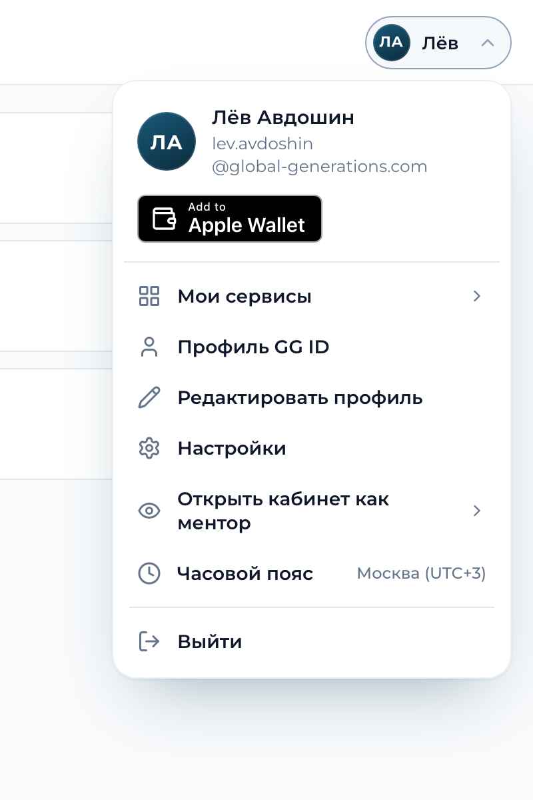

# Меню аккаунта GG: `GGAccountMenu`

Одно меню аккаунта во всех сервисах команды Global Generation. Справа в шапке чип с инициалами (круг navy-градиента, у «Лёв Авдошин» это «ЛА»), под ним белая карточка с закруглением: имя и почта, под ними чёрный значок **Add to Apple Wallet** (карта GG ID в Wallet), **«Мои сервисы»** (список сервисов человека, в любой заходишь одним нажатием), **«Профиль GG ID»**, пункты самого сервиса, черта, **«Выйти»**. Вид один в один как у АКБ: те же классы и те же стили кита (`.gid-chip`, `.gid-menu`, `.gid-menu-item`), не копия «похоже».

Без зависимостей, без сборки, без запросов наружу: единственный адресат хаб GG ID (список сервисов при первом открытии, на страницах самого хаба ещё его выход). Все адреса хаба заданы по умолчанию (раздел «Адреса хаба»), сервис передаёт только своё: имя, почту, выход, свои пункты. Данные человека и хаба попадают на страницу только через `textContent`.



- Демо: `demo.html` (светлая тема, компьютер и телефон 390 px, состояния списка: загружен, долго, нет входа, хаб не отвечает, пусто, нет сети).
- Подключение: два файла, `gg-account-menu.css` и `gg-account-menu.js`, и Montserrat самохостом (`../fonts/`, сервисы его уже подключают).
- Версия: `gg-id/VERSION`, её же отдаёт `GGAccountMenu.version`.

| Файл | Что внутри |
|---|---|
| `gg-account-menu.js` | компонент: `GGAccountMenu.mount(el, options)`, иконки lucide инлайном, клавиатура, список сервисов |
| `gg-account-menu.css` | **генерируется** из `gg-id/gg-id.css` (токены обеих тем, чип, меню, аватар: байт в байт) и `src/account_menu/local.css` (список сервисов, раскрывающиеся пункты, чип на узком экране). Руками не править |
| `demo.html` | демо, открывается как есть (`file://` тоже) |
| `preview/` | картинки для README и PR, обновляет `src/check_account_menu.py --preview` |

## Что в меню

| Строка | Что делает | Откуда |
|---|---|---|
| Имя и почта | шапка карточки, почта переносится перед `@` | `name`, `email` |
| **Add to Apple Wallet** | последняя строка шапки (под именем и почтой): чёрный значок на английском, ссылка на подписанную карту GG ID, ту же, что в кабинете хаба. По умолчанию виден на iPhone, iPad и в Safari на Mac (как в кабинете); на остальных устройствах его нет, там файл Wallet некуда положить. Нажатие скачивает карту, страница сервиса остаётся на месте | `walletUrl`, `wallet`, `walletImage` |
| **Мои сервисы** | раскрывается внутри этой же карточки: плитка и название сервиса, нажатие ведёт прямо в него, текущий сервис помечен «Вы здесь», внизу «Все сервисы» (кабинет хаба). Список не загрузился (нет входа в хабе, хаб не отвечает, чужой адрес страницы, пусто, нет сети) = пункт становится обычной ссылкой на кабинет хаба | `servicesApi`, `servicesUrl` |
| **Профиль GG ID** | страница хаба, где человек управляет профилем, Face ID / Touch ID (passkey) и паролем | `profileUrl` |
| Свои пункты сервиса | ссылка, действие, строка с пометкой справа (часовой пояс), раскрывающийся список («Открыть кабинет как ментор») | `items` |
| **Выйти** | выход везде: **прежний выход сервиса**, который заодно завершает сессию хаба. Новых путей выхода кит не придумывает (страница самого хаба выходит из хаба, раздел «Выйти = выйти везде») | `logoutUrl`, `logoutMethod`, `onLogout` |

На телефоне (до 600 px) в шапке остаётся круг 40 px с инициалами, как в АКБ; карточка 300 px, всегда внутри экрана. Вариант `variant: 'avatar'` держит круг на любой ширине.

## Подключение

Три сценария, один компонент. Адреса хаба заданы по умолчанию (боевой хаб `id.global-generations-edu.com`, раздел «Адреса хаба»): «Мои сервисы», «Профиль GG ID», список сервисов и значок Wallet работают без единого адреса в коде сервиса. `hubOrigin` (из настройки сервиса `GG_AUTH_ORIGIN`) нужен только если хаб не боевой (стенд) или переехал.

### а) Серверная страница (Jinja, обычный HTML)

Ни одной своей строки скрипта: компонент сам находит `data-gg-account-menu` и рисует меню.

```html
<link rel="stylesheet" href="/static/gg-id/gg-account-menu.css">
...
<div id="gg-account" data-gg-account-menu
     data-name="{{ user.name }}" data-email="{{ user.email }}"
     data-current-key="akb" data-logout-url="/logout"
     data-gam-items='{{ own_items | tojson }}'></div>
<script src="/static/gg-id/gg-account-menu.js" defer></script>
```

- Значения в атрибутах экранирует Jinja (автоэкранирование включено), JSON для `data-gam-items` кладите в атрибут в **одинарных** кавычках (`tojson` сам экранирует `'`, `<`, `>`, `&`). Весь конфиг можно отдать одним JSON: `data-gg-account-menu='{{ cfg | tojson }}'`.
- Другой хаб: `data-hub-origin="{{ gg_auth_origin }}"`. Убрать значок Wallet: `data-wallet="false"`, показывать на любом устройстве: `data-wallet="true"`. Отдельные адреса: `data-services-url`, `data-profile-url`, `data-services-api`, `data-wallet-url` (`false` убирает пункт или значок).
- Действие без ссылки (окно профиля, «Выйти» через JS сервиса) делается событием: у пункта есть `id`, а страница слушает `gam:select`:

```html
<script>
  document.getElementById('gg-account').addEventListener('gam:select', function (e) {
    if (e.detail.id === 'edit-profile') openProfileModal();
    if (e.detail.id === 'logout') logout();            // прежний logout() сервиса: POST на выход сервиса и завершение сессии хаба
  });
</script>
```
`items` в атрибуте: `[{"id":"edit-profile","label":"Редактировать профиль","icon":"pencil"},{"id":"settings","label":"Настройки","icon":"settings","href":"/admin/users"}]`. Пункт «Выйти» без `logoutUrl` и `onLogout` остаётся кнопкой и шлёт `gam:select` с `id: "logout"`.

### б) React и Next

Компонент не React-овский, поэтому тонкая обёртка: подключить скрипт один раз и вызвать `mount`. Файлы лежат в `public/gg-id/`. Пункты сервиса в React это данные (`id`, `label`, `icon`, `href`, `meta`), а действия (окно профиля, выход) приходят событием `gam:select`: так нет устаревших функций в замыканиях и меню не перерисовывается на каждый рендер родителя.

```tsx
'use client';
import { useEffect, useRef } from 'react';

type Item = { id?: string; label: string; icon?: string; href?: string; meta?: string };
type Options = { name: string; email: string; hubOrigin?: string; logoutUrl?: string; wallet?: boolean | 'auto'; currentKey?: string; items?: Item[] };
type Handle = { update(o: object): void; destroy(): void };
declare global {
  interface Window { GGAccountMenu?: { mount(el: Element, o: object): Handle }; GG_ACCOUNT_MENU_MANUAL?: boolean }
}

let loading: Promise<void> | null = null;
function loadKit(): Promise<void> {
  if (window.GGAccountMenu) return Promise.resolve();
  window.GG_ACCOUNT_MENU_MANUAL = true;                       // разметку рисует React, автозапуск по data-атрибутам не нужен
  loading ??= new Promise((resolve, reject) => {
    const s = document.createElement('script');
    s.src = '/gg-id/gg-account-menu.js';
    s.onload = () => resolve();
    s.onerror = () => reject(new Error('gg-account-menu.js'));
    document.head.appendChild(s);
  });
  return loading;
}

export function AccountMenu({ onSelect, ...options }: Options & { onSelect?: (id: string) => void }) {
  const box = useRef<HTMLDivElement>(null);
  const menu = useRef<Handle | null>(null);
  const select = useRef(onSelect);
  select.current = onSelect;                                  // всегда зовётся самая свежая функция
  const shape = JSON.stringify(options);                      // перерисовка только когда данные изменились
  const latest = useRef(shape);
  latest.current = shape;
  useEffect(() => {
    const el = box.current!;
    const on = (e: Event) => select.current?.((e as CustomEvent).detail.id);
    el.addEventListener('gam:select', on);
    let gone = false;
    loadKit().then(() => { if (!gone) menu.current = window.GGAccountMenu!.mount(el, JSON.parse(latest.current)); });
    return () => { gone = true; el.removeEventListener('gam:select', on); menu.current?.destroy(); menu.current = null; };
  }, []);
  useEffect(() => { menu.current?.update(JSON.parse(shape)); }, [shape]);
  return <div ref={box} />;
}
```
Использование: `<AccountMenu name={user.name} email={user.email} currentKey="akb" items={[{ id: 'settings', label: 'Настройки', icon: 'settings', href: '/settings' }]} onSelect={(id) => { if (id === 'logout') signOut(); }} />`. Без `logoutUrl` «Выйти» это кнопка, она шлёт `gam:select` с `id: "logout"`; `signOut()` это прежний выход сервиса (он же завершает сессию хаба). Адреса хаба по умолчанию боевые; для стенда добавьте `hubOrigin={process.env.NEXT_PUBLIC_GG_AUTH_ORIGIN}`.

Стили: `<link rel="stylesheet" href="/gg-id/gg-account-menu.css">` в корневом `layout.tsx` (или импорт копии файла в глобальный CSS). `'use client'` обязателен: компонент трогает `window` и `document`.

### в) Статичная страница

```html
<link rel="stylesheet" href="/assets/gg-id/gg-account-menu.css">
<div id="account"></div>
<script src="/assets/gg-id/gg-account-menu.js"></script>
<script>
  GGAccountMenu.mount('#account', {
    name: 'Иван Образцов', email: 'ivan.obraztsov@global-generations.com',
    logoutUrl: '/logout'                    // или onLogout: function () { ... }
  });
</script>
```
Имя и почту странице отдаёт её собственный сервер или сессия сервиса; кит их не добывает. Страница самого хаба (кабинет, админка, личный борд) может не указывать и выход: на своём origin меню выходит из хаба само (раздел «Выйти = выйти везде»).

## Параметры `GGAccountMenu.mount(el, options)`

`el`: элемент или селектор. Элемент становится обёрткой (`.gid-kit.gam`), его содержимое заменяется (запасная разметка для случая «без JS» внутри допустима). Повторный `mount` на том же элементе обновляет меню и возвращает тот же объект.

Те же параметры атрибутами элемента с `data-gg-account-menu`: `data-name`, `data-email`, `data-subtitle`, `data-hub-origin`, `data-services-url`, `data-services-api`, `data-services`, `data-profile-url`, `data-profile`, `data-wallet`, `data-wallet-url`, `data-wallet-image`, `data-logout-url`, `data-logout-method`, `data-logout-next`, `data-current-key`, `data-gam-theme`, `data-gam-placement`, `data-gam-variant`; свои пункты JSON-ом в `data-gam-items`, весь конфиг JSON-ом в самом `data-gg-account-menu='{...}'`. Строка `false` становится булевым значением в `data-hub-origin`, `data-services`, `data-services-api`, `data-profile`, `data-wallet-url` и `data-wallet`; строка `true` только в `data-wallet`.

| Параметр | По умолчанию | Что |
|---|---|---|
| `name` | `Аккаунт` | полное имя; инициалы из первых букв двух первых слов, в чипе первое слово |
| `email` | нет | почта под именем; нет почты, показывается `subtitle` |
| `subtitle` | нет | вторая строка, если почты нет (например роль) |
| `hubOrigin` | `https://id.global-generations-edu.com` | origin хаба GG ID. Из него и путей из раздела «Адреса хаба»: `servicesUrl`, `profileUrl`, `servicesApi`, `walletUrl`. Не задан = боевой хаб. Другой хаб (стенд, переезд): `GG_AUTH_ORIGIN` сервиса. Нужен абсолютный адрес `https://...` (или `http://localhost...`). Пустое значение (настройка не задана) и всё, что не абсолютный адрес, дают боевой хаб (во втором случае ещё предупреждение в консоли): ошибка в настройке не отнимает у меню «Мои сервисы», а относительный адрес не превращается молча в «этот же сервис». `false` (в атрибуте `data-hub-origin="false"`) = адресов хаба нет совсем (нет «Мои сервисы», «Профиль GG ID» и значка Wallet, остаются свои пункты и «Выйти») |
| `servicesUrl`, `profileUrl` | из `hubOrigin` | явные адреса вместо вычисленных |
| `servicesApi` | из `hubOrigin` | откуда брать список сервисов; `false` = не спрашивать, «Мои сервисы» сразу ссылка на кабинет |
| `services` | список из хаба | `false` убирает пункт совсем (так делает сам кабинет хаба); массив `[{key, title, url, icon}]` рисуется как есть, без запроса |
| `profile` | `true` | `false` убирает «Профиль GG ID» |
| `walletUrl` | из `hubOrigin` | адрес подписанной карты GG ID для Apple Wallet (`<hub>/api/auth/wallet/apple.pkpass`); `false` убирает значок |
| `wallet` | `'auto'` | когда показывать значок Apple Wallet: `'auto'` только на iPhone, iPad и в Safari на Mac (правило кабинета хаба), `true` на любом устройстве (демо), `false` никогда |
| `walletImage` | нет | адрес официального файла значка Apple (SVG, как выдал Apple, без правок); вместо нарисованного значка показывается он, ссылка та же (раздел «Значок Apple Wallet») |
| `currentKey` | по адресу страницы | ключ сервиса, в котором стоит страница (помечается «Вы здесь»); без него совпадение по адресу, самый длинный путь побеждает |
| `servicesTarget` | `_self` | `_blank` открывает сервисы в новой вкладке (`noopener`) |
| `servicesTimeout` | `6000` | мс до отказа от ожидания списка |
| `items` | `[]` | свои пункты, см. ниже |
| `logoutUrl` | нет | прежний выход сервиса: обычная ссылка (GET) |
| `logoutMethod`, `logoutFields` | `GET`, нет | `POST` отправляет настоящую форму на `logoutUrl` (с кукой), `logoutFields` - скрытые поля формы, например `csrf_token` |
| `onLogout` | нет | функция вместо ссылки: `onLogout(event, handle)` (например прежний `logout()` сервиса) |
| `logoutNext` | `/login.html` хаба | только для страницы самого хаба без `logoutUrl` и `onLogout`: куда идти после выхода из хаба |
| `theme` | `light` | `light`, `dark` или `auto` (по системе). У АКБ тёмной темы нет |
| `placement` | `end` | `start`, если меню стоит слева и карточка должна открываться вправо |
| `variant` | `chip` | `avatar`: круг с инициалами на любой ширине |
| `labels` | русские | тексты: `account`, `services`, `profile`, `profileTitle`, `logout`, `loading`, `failed`, `allServices`, `current`. Значок Apple Wallet всегда английский (решение владельца 10.10), его текст не меняется |

### Пункт `items[]`

| Поле | Что |
|---|---|
| `label` | текст (только текст, разметка не работает) |
| `icon` | имя иконки lucide из набора кита: `GGAccountMenu.icons` (user, pencil, settings, eye, clock, key-round, scan-face, shield-check, circle-help, book-open, bell, mail, file-text, calendar, languages, users, graduation-cap, activity, message-square, video, scale, megaphone, globe, server, layout-grid, external-link, wallet, check ...). Нет в наборе: добавить в кит PR-ом или передать `iconPaths: ['M...']` (путь `d` на сетке 24 x 24) |
| `href`, `target` | ссылка (https, адрес своей страницы, http только localhost); другие схемы отбрасываются, пункт становится кнопкой |
| `onClick` | `onClick(event, handle)`; после клика меню закрывается |
| `id` | идентификатор для события `gam:select` |
| `meta` | пометка справа («Москва (UTC+3)») |
| `title` | подсказка |
| `static: true` | строка без действия (только показ) |
| `panel` | раскрывающийся список внутри меню: `{items: [...]}` или `{load: function () { return Promise<[...]> }}` (грузится при первом раскрытии, ошибка = «Не удалось загрузить», следующее раскрытие пробует снова). Строки такие же, как у `items` |
| `type: 'separator'` | черта |

Пример (то, что есть в меню АКБ):

```js
GGAccountMenu.mount('#account', {
  name: user.name, email: user.email, currentKey: 'akb',
  onLogout: logout,
  items: [
    { id: 'edit-profile', label: 'Редактировать профиль', icon: 'pencil', onClick: openProfileModal },
    { id: 'settings', label: 'Настройки', icon: 'settings', href: '/admin/users' },
    { id: 'view-as', label: 'Открыть кабинет как ментор', icon: 'eye', panel: { load: loadMentorRows } },
    { id: 'timezone', label: 'Часовой пояс', icon: 'clock', meta: tzLabel, onClick: openTimezoneModal }
  ]
});
```

### Возвращаемый объект, события, статический API

`handle`: `open()`, `close()`, `toggle()`, `isOpen()`, `update(options)` (новое имя, пункты; открытое меню остаётся открытым), `refreshServices()` (спросить список ещё раз), `destroy()` (вернуть элемент как был), `el`.

События на обёртке (всплывают): `gam:open`, `gam:close`, `gam:select` (`detail.id`, `detail.label`; для сервиса из списка `id: "service"` и `detail.key`, для значка Wallet `id: "wallet"`), `gam:services` (`detail.status`: `ready` или `failed`, `detail.count`).

`GGAccountMenu.version`, `.mount`, `.init(root)` (повесить все `[data-gg-account-menu]` внутри `root`), `.initials(name, email)`, `.icons`, `.hub` (канонические адреса хаба, из которых сделаны умолчания), `.walletDevice(navigator)` (правило `'auto'` для значка Wallet), `.reset()` (забыть кэш списка). `window.GG_ACCOUNT_MENU_MANUAL = true` до скрипта выключает автозапуск по атрибутам (React и поздняя разметка).

## Выйти = выйти везде

Решение владельца 08.10: «Выйти» завершает человека во всех сервисах. Меню этого само не делает и новый выход не заводит: оно вызывает **прежний выход сервиса**. Сервис со входом через GG ID при выходе просит хаб закрыть сессию (`POST /api/v1/sessions/revoke`, Basic клиента, с сервера сервиса), остальные сервисы перестают пускать человека при ближайшей сверке (раз в минуту).

- АКБ: `onLogout: logout` (прежний `logout()` делает `POST /api/auth/logout`, сервер завершает сессию хаба).
- Сервис с обычной ссылкой выхода: `logoutUrl: '/logout'`; с формой и токеном: `logoutMethod: 'POST'`, `logoutFields: { csrf_token: '...' }`.
- Страницы самого хаба (кабинет, админка, личный борд; страница, у которой origin совпадает с `hubOrigin`): без `logoutUrl` и `onLogout` меню делает выход хаба само: `POST /api/auth/logout` с того же origin и кукой, затем страница входа хаба (`/login.html`, или `logoutNext`). Чужому origin хаб отвечает 403 `bad_origin`, поэтому со страницы сервиса его не зовут: сервис выходит своим выходом.
- Страница сервиса без `logoutUrl` и `onLogout`: «Выйти» остаётся кнопкой, которая только шлёт `gam:select` с `id: "logout"`.

## Список сервисов: `GET /api/auth/service-links` хаба

Меню спрашивает список один раз за страницу, при первом открытии (не при загрузке страницы). Запрос идёт **с кукой хаба** (`credentials: 'include'`), ответ кэшируется на страницу; сбой тоже запоминается (дальше обычная ссылка), `refreshServices()` спрашивает заново.

```
GET https://<хаб>/api/auth/service-links           Accept: application/json, кука gg_portal_session
200 {"services": [{"key": "akb", "title": "Mentorship-AKB", "url": "https://akb.global-generations-edu.com", "icon": "users"}, ...]}
```

- В ответе только сервисы, которые человек может открыть (у команды и админа весь каталог с адресом, у остальных то, что дают должности и роли), без служебных полей. `icon` из набора кита; незнакомая иконка рисуется как `layout-grid`. Порядок как в кабинете хаба.
- CORS с куками, как у `GET /api/auth/card`: `Access-Control-Allow-Origin` = origin страницы (не `*`), `Access-Control-Allow-Credentials: true`, `Vary: Origin`. Хаб разрешает только свои origin и https-origin активных клиентов реестра `client_origins` (те, что ходят в хаб через GG ID). Любой другой `Origin` получает 403 `bad_origin` без заголовков CORS, браузер ответ не отдаёт, меню остаётся с обычной ссылкой.
- 401 нет сессии хаба, 403 нет уровня, 503 база не отвечает: везде меню падает на ссылку «Мои сервисы» на кабинет.
- Если у сервиса есть `Content-Security-Policy`, в `connect-src` должен стоять адрес хаба (`GG_AUTH_ORIGIN`): иначе браузер заблокирует запрос и «Мои сервисы» останется ссылкой. Остальное меню ничего не требует (ни inline-скриптов, ни inline-стилей из разметки: положение карточки ставится через CSSOM).
- Ограничение браузера: кука хаба принадлежит хосту `id.global-generations-edu.com` и лежит с `SameSite=Lax`. Кука уйдёт только со страниц того же сайта, то есть с хостов `*.global-generations-edu.com`. Страницы на другом домене (`global-generations.com`, `global-generations.us`) списка не получат: у них «Мои сервисы» всегда ссылка на кабинет. Чтобы список появился на странице хоста нового сервиса, его origin должен быть заведён клиентом хаба (`add-origin`).

## Значок Apple Wallet

Последняя строка шапки карточки: чёрный значок «Add to Apple Wallet» (английский текст, решение владельца 10.10) со ссылкой на карту GG ID в Wallet. Ссылка ведёт на `GET /api/auth/wallet/apple.pkpass` хаба (Infra-AWS `docs/wallet.md`): хаб собирает подписанный `.pkpass` из своей сессии человека (имя, должности, номер GG ID, без почты), отвечает вложением, поэтому страница сервиса остаётся на месте, а Safari сам открывает Wallet. Кука хаба идёт с обычной навигацией, отдельного запроса меню не делает.

- **Где виден.** `wallet: 'auto'` (по умолчанию): только iPhone, iPad (в том числе в режиме «версия для компьютера») и Safari на Mac, то есть там же, где кнопка в кабинете хаба (`cabinet/wallet.js`). На Windows, Android и в Chrome, Firefox, Edge на Mac файл Wallet положить некуда, значок там только мешал бы. `wallet: true` показывает его везде (демо), `wallet: false` убирает, `walletUrl: false` тоже.
- **Клавиатура.** Значок пункт меню (`role="menuitem"`): достаётся стрелками и Home, при открытии с клавиатуры первая остановка «Мои сервисы», на значок попадаешь стрелкой вверх.
- **Правила Apple** (developer.apple.com/wallet/add-to-apple-wallet-guidelines): без теней, свечения, прозрачности, поворота и анимации; на значке ничего не лежит; вокруг свободное место не меньше 0,1 его высоты (у нас 12 px сверху и 14 px снизу при высоте 36 px); значок рядом с картой и не главный элемент. Всё это держит `src/check_account_menu.py`.
- **Нарисованный значок временный.** Apple требует показывать **их собственный файл** значка и не рисовать свои версии, а скачать файл можно только приняв лицензию Apple (кнопка «Download badge files» на странице правил). Это решение человека, а не агента, поэтому сейчас значок нарисован в виде Apple (чёрный, серая рамка 1 px `#A6A6A6`, две строки текста, знак кошелька) и помечен здесь как временный. Заменить на официальный: положить файл `US-UK_Add_to_Apple_Wallet_RGB_*.svg` (английский вариант, как скачан, без правок) на хост сервиса или хаба и передать `walletImage: '/static/gg-id/US-UK_Add_to_Apple_Wallet_RGB_101421.svg'`. Файл показывается как есть: высота 36 px, без нашей рамки и фона. В хабе в кабинете сейчас лежит русский вариант `RU_Add_to_Apple_Wallet_RGB_102121.svg`; английский должен лечь рядом с ним, тогда адрес можно сделать значением по умолчанию в `HUB` кита (одна строка и новая версия кита).

## Адреса хаба (умолчания кита)

Хаб один, его адреса лежат в константе `HUB` в `gg-account-menu.js` и во всех строках этой таблицы. `hubOrigin` меняет origin у всех сразу, отдельные опции меняют один адрес.

| Что | Адрес по умолчанию | Опция |
|---|---|---|
| Мои сервисы (кабинет хаба) | `https://id.global-generations-edu.com/cabinet/` | `servicesUrl` |
| Профиль GG ID (профиль, Face ID / Touch ID, пароль) | `https://id.global-generations-edu.com/cabinet/#face` | `profileUrl` |
| Список сервисов человека | `GET https://id.global-generations-edu.com/api/auth/service-links` | `servicesApi` |
| Карта GG ID для Apple Wallet | `https://id.global-generations-edu.com/api/auth/wallet/apple.pkpass` | `walletUrl` |
| Выход со страницы хаба | `POST https://id.global-generations-edu.com/api/auth/logout`, затем `https://id.global-generations-edu.com/login.html` | `onLogout`, `logoutUrl`, `logoutNext` |

Выход хаба в таблице только для страниц самого хаба (чужому origin хаб отвечает 403 `bad_origin`). Сервис выходит своим выходом: он заодно просит хаб закрыть сессию. Список сервисов: хаб отвечает только origin из реестра клиентов, см. раздел выше.

## Клавиатура и доступность

| Что | Как |
|---|---|
| Открыть | клик по чипу; Enter или пробел на чипе (фокус на первый пункт); ↓ на закрытом чипе (первый пункт), ↑ (последний) |
| Ходить | ↓ ↑ Home End по видимым пунктам (раскрытый список сервисов тоже), по кругу |
| Раскрыть и свернуть «Мои сервисы» | Enter, пробел или клик; → раскрывает, ← внутри списка сворачивает и возвращает на пункт |
| Закрыть | Esc (фокус на чип, из любого места, даже если фокус упал на body, как в Safari и Firefox), Tab, клик или касание вне меню, уход фокуса |
| Роли | чип: `aria-haspopup="menu"`, `aria-expanded`, `aria-controls`, имя «Аккаунт: имя» берётся из содержимого кнопки (строка, которую читают только скринридеры, она же в узком чипе, где видны одни инициалы), `aria-label` нет: видимые слова остаются частью имени; карточка `role="menu"`; пункты `role="menuitem"`; список `role="group"`; черта `role="separator"`; «Загружаем сервисы» `role="status"` |
| Фокус | сплошная линия 2 px `--g-focus` (`#009CDC`) с отступом, как у всего кита |
| Меньше движения | анимации и переходы выключаются |

Открыто только одно меню на странице. Закрытая карточка складывает раскрытые списки. Карточка не выходит за экран: сдвигается, если чип не у края, и прокручивается внутри, если окно низкое. Касания: закрытие вне меню ловится по `pointerdown`, потому что iOS Safari не шлёт `click` по пустым местам страницы.

## Безопасность

- Всё, что приходит от человека или хаба (имя, почта, названия сервисов, подписи пунктов, пометки), идёт в страницу через `textContent` и `setAttribute`. Нет `innerHTML`, `insertAdjacentHTML`, `eval`, `document.write`; проверяет `src/check_account_menu.py`.
- Адрес допускается, если это https, адрес своей страницы или http на localhost. `javascript:`, `data:`, чужой http отбрасываются (строка списка пропадает, пункт `items` становится кнопкой). Название сервиса режется до 120 знаков, в списке не больше 200 строк, дубли по ключу убираются, неизвестная иконка заменяется.
- Нет `localStorage`, кук, `postMessage`, сторонних адресов. Единственный адресат хаб GG ID: `GET` списка сервисов (с таймаутом) и, только на странице самого хаба, `POST` его выхода на том же origin. Значок Wallet это обычная ссылка, запроса из кода у него нет.
- Адрес хаба записан в коде один раз (константа `HUB`, боевой хаб `id.global-generations-edu.com`) и в README; другой хаб сервис задаёт через `hubOrigin` из своих настроек (`GG_AUTH_ORIGIN`). Старого адреса levauth в коде нет, проверяет `src/check_account_menu.py`.

## Правила вида

- Тот же вид, что у АКБ: чип 40 px с инициалами (28 px, градиент `--g-avatar`), карточка 300 px, радиус 18, пункты 14 px 600. Это те же классы кита, `gg-account-menu.css` их не переписывает, а копирует из `gg-id.css`.
- Плитка сервиса: светлый градиент `#8FBADD` - `#4B8FD6` (токен `--g-tile`, правило 4a бренда), белая иконка lucide, без тёмной тени. Иконки сервисов те же, что в кабинете хаба (ключ сервиса, иначе раздел каталога, иначе `layout-grid`).
- Значок Apple Wallet: чёрный (`#000`, рамка 1 px `#A6A6A6`, белый текст), 36 px высотой, один и тот же в светлой и тёмной теме; больше ничего чёрного в карточке нет.
- Эмодзи нет, длинных тире нет, сиреневого нет, полосок слева нет. Голубой `#009CDC` только фокус.
- Карточка лежит выше шапки (`z-index: 60`, как у кита). Если у сервиса шапка выше, поставьте `--gam-z` на обёртку: `#account { --gam-z: 200 }`. Карточка не обрезается шапкой, пока у шапки нет `overflow: hidden`.
- Обёртка называется `.gam`, а не `.gid-acct`, чтобы `gg-id-service.js` не оживил то же меню второй раз (два обработчика на одном чипе открывают и закрывают меню одним кликом). Окно «Сессия истекла» и перехват 401 из `gg-id-service.js` работают рядом как раньше.

## Чек-лист подключения сервиса

1. Скопировать `gg-account-menu.js` и `gg-account-menu.css` (версия кита в первой строке) рядом с `gg-id-service.js`, Montserrat уже подключён.
2. Заменить свою разметку чипа и меню на `data-gg-account-menu` или `GGAccountMenu.mount`. Свои пункты (профиль, настройки, часовой пояс и так далее) перенести в `items` с теми же иконками и подписями.
3. Адреса хаба уже боевые по умолчанию, ничего передавать не надо; `hubOrigin` из `GG_AUTH_ORIGIN` только для стенда. «Выйти» = прежний выход сервиса (`onLogout`, `logoutUrl` или `gam:select` с `id: "logout"`).
4. Нужен список сервисов: origin сервиса заведён клиентом хаба (`add-origin`) и страница на хосте `*.global-generations-edu.com`. Иначе «Мои сервисы» остаётся ссылкой на кабинет, это нормально (сервис на другом домене может отдать список сам: `services: [...]`).
5. Значок Apple Wallet появится сам на iPhone, iPad и в Safari на Mac. Не нужен сервису: `wallet: false`.
6. Content-Security-Policy сервиса (если есть): `connect-src` с адресом хаба (список сервисов), `img-src` с адресом файла значка, если подключён `walletImage`.
7. Мобильное меню (бургер) сервиса оставить как есть или поставить тот же компонент с `variant: 'avatar'`.
8. Проверить на 390 px: круг справа, карточка внутри экрана, «Выйти» работает.

## Пересобрать и проверить

```
python3 src/build_account_menu.py                              # gg-account-menu.css из gg-id.css и src/account_menu/local.css
python3 src/build_account_menu.py --check                      # файл совпадает с тем, что делает кит (без записи)
uv run --with playwright python src/check_account_menu.py      # исходники, вид (против разметки АКБ), клавиатура, значок Wallet, умолчания хаба, список сервисов с настоящим CORS, безопасность, 390 px, демо
GGAM_ENGINE=webkit uv run --with playwright python src/check_account_menu.py   # то же в WebKit (и firefox); в CI идёт Chromium
uv run --with playwright python src/check_account_menu.py --preview            # после зелёного прогона обновить preview/
GGAM_SHOTS=/путь uv run --with playwright python src/check_account_menu.py     # куда класть скриншоты (по умолчанию shots/account-menu/, в git не попадает)
```

Настоящий хаб прогон не трогает: любой запрос на `id.global-generations-edu.com` контекст браузера обрывает, а проверка умолчаний отвечает за него сама.

Правки вида: `gg-id/gg-id.css` (чип, меню, токены) или `src/account_menu/local.css` (список сервисов, чип на узком экране), затем `build_account_menu.py`. Правки поведения: `gg-account-menu.js`. После любой правки поднять `gg-id/VERSION` (и `version` в `gg-id.js`, `gg-id-service.js`, первую строку `gg-id.css`, `var VERSION` и первую строку `gg-account-menu.js`), прогнать `python3 src/build_gg_id.py`.
